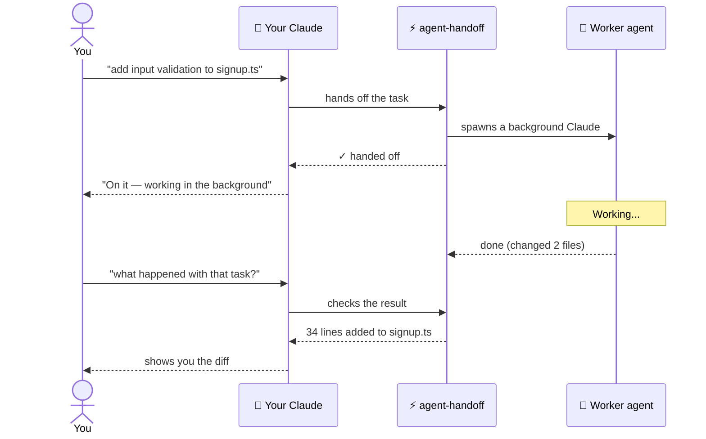
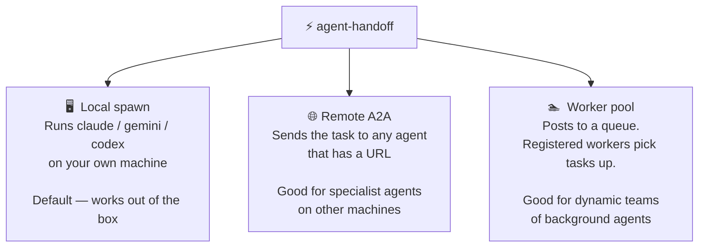
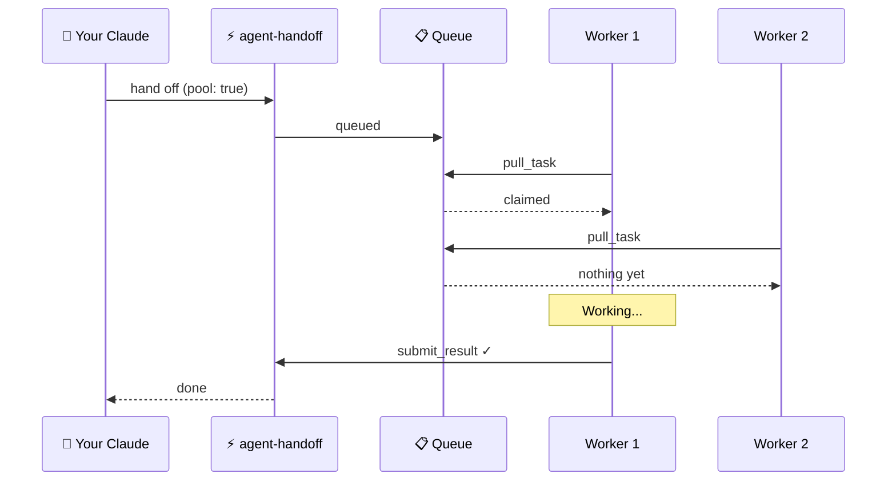

# agent-handoff

**Give your AI a team.** Instead of waiting for one agent to finish before starting the next thing, hand tasks off to background workers — Claude, Gemini, Codex — and get results while you keep working.

Works with any MCP-compatible editor: Claude Code, Cursor, Windsurf, Zed, Claude Desktop.

---

## How it works



Your main AI never stops. The work happens in the background. You get the result when it's done.

---

## Install

> **Requires Bun.** If you don't have it: `curl -fsSL https://bun.sh/install | bash`

```bash
npm install -g @daax-dev/agent-handoff
```

---

## Connect to Claude Code

```bash
claude mcp add agent-handoff -- agent-handoff-mcp
```

Restart Claude Code. That's it — Claude can now spawn background agents.

<details>
<summary>Other editors (Cursor, Windsurf, Zed, Claude Desktop)</summary>

Add to your MCP config file:

```json
{
  "mcpServers": {
    "agent-handoff": {
      "command": "agent-handoff-mcp"
    }
  }
}
```

Config file locations: [docs/installation-guide.md](docs/installation-guide.md)

</details>

---

## Using it from Claude Code

> **You talk to Claude normally. Claude calls agent-handoff behind the scenes.**
> You never type `handoff_task(...)` yourself — Claude does that automatically.

### Check what agents are available

Say to Claude:
> *"What agents do you have available?"*

Claude asks agent-handoff, which checks your PATH and tells you what's installed:

```
✓  claude    available
✗  codex     not found
✓  gemini    available
```

### Hand off a task

Say to Claude:
> *"Hand off the input validation work on signup.ts to a background Claude"*

or more naturally:
> *"Spin up a worker to add rate limiting to the API — I'll keep working while it runs"*

Claude dispatches it. You get a job ID back and can keep going.

### Check on it

Say to Claude:
> *"How's that background task going?"*

```
● running   18.3s   Add input validation to signup.ts
```

### Get the result

Say to Claude:
> *"Show me what the worker changed"*

```
✓ done   1 file changed
src/routes/signup.ts   +34  −2
```

### Run multiple at once

Say to Claude:
> *"Spin up three workers: one to add input validation, one to optimize the DB queries, one to add tests for the auth module"*

```
● running    4.1s   Add input validation
● running   12.3s   Optimize DB queries
● running    1.8s   Add tests for auth module
```

All three run in parallel. Claude reports back when each one finishes.

---

## Three ways to delegate



### Local spawn (default)

Works without any extra setup. agent-handoff spawns the agent as a child process and captures its output, exit code, and git diff.

Say to Claude:
> *"Hand this off to a local Claude worker — use the opus model"*

Want to watch the agent work in a visible terminal window? Say:
> *"Hand this off in a tmux window so I can watch"*

This opens a `daax-claude` tmux pane and runs the agent there in real time.

---

### Remote A2A

Register any agent that speaks the [A2A protocol](https://google.github.io/A2A/) by URL. Once registered, you can hand tasks to it just like a local agent.

Say to Claude:
> *"Register the research agent at https://research.example.com with token tok_abc"*

Then:
> *"Hand this summarization task off to the remote research agent"*

Cross-machine setup and authentication: [docs/cross-machine-and-auth.md](docs/cross-machine-and-auth.md)

---

### Worker pool

Post tasks to a queue. Separate worker processes pull tasks and execute them. Useful when you want a fleet of agents running, or when availability is dynamic (workers come and go).



Workers must send a heartbeat every 60 seconds to stay online.

---

## Managing tasks from your terminal

> **These are terminal commands.** Run them in a shell — not inside Claude Code.

First, start the API server in one terminal:

```bash
agent-handoff-server
# listening on http://localhost:4000
```

Then use the CLI in another terminal:

```bash
export AGENT_HANDOFF_URL=http://localhost:4000

agent-handoff new "add rate limiting"    # create a new task
agent-handoff list                        # see all active tasks
agent-handoff status chg_000001          # detail on one task
agent-handoff review chg_000001          # check CI + review comments
agent-handoff approve chg_000001         # approve it
agent-handoff merge chg_000001           # merge the branch
agent-handoff export chg_000001          # push branch + open a GitHub PR
agent-handoff import-issue <github-url>  # pull in a GitHub issue as a task
```

---

## Advanced

### Pass context to the next agent

If one agent finishes part of a job and you want the next agent to pick up where it left off, include a context payload. It carries what was done, what decisions were made, and what comes next — so the receiving agent isn't starting blind.

```typescript
import { createHandoffContext, serializeContext } from "@daax-dev/agent-handoff/handoff-context";

const context = serializeContext(createHandoffContext({
  sourceJobId: "hnd_prev123",
  completed_tasks: [{ id: "t-1", title: "Built auth scaffold" }],
  decisions: [{ description: "Use HMAC-SHA256", rationale: "no SPIFFE lib available" }],
  modified_files: [{ path: "src/auth/spiffe.ts", changeType: "added" }],
  next_steps: [{ order: 1, description: "Write integration tests" }]
}));

// Then tell Claude:
// "Continue the auth work — here's what was done already" (attach context)
```

Payloads are compressed. Limits: 50 KB compressed, 500 KB uncompressed.

### Definition of Done

Require the worker to commit to success criteria before the task starts. If it can't meet a required criterion, the handoff fails immediately rather than running to completion and producing something unusable.

Tell Claude:
> *"Hand this off with DoD: all tests must pass, TypeScript must compile cleanly"*

Under the hood:
```
dodCriteria: [
  { description: "All tests pass",           required: true },
  { description: "TypeScript compiles",      required: true },
  { description: "API docs updated",         required: false }
]
```

If the worker rejects a required criterion, you'll know before any work is done.

---

## Configuration

### MCP server

| Variable | Default | What it does |
|----------|---------|-------------|
| `HANDOFF_LOG_DIR` | `.logs/handoffs` | Where to write event logs |
| `HANDOFF_LOG_PROMPTS` | `false` | Set `true` to include prompt text in logs (redacted by default) |
| `HAWKEYE_URL` | _(unset)_ | Endpoint to notify when a DoD handshake times out |
| `RECEIVER_CAPABILITIES` | _(unset)_ | Capabilities this server evaluates for DoD locally |

### REST API server

| Variable | Default | What it does |
|----------|---------|-------------|
| `PORT` | `4000` | Port to listen on |
| `API_TOKEN` | _(unset)_ | Require `Authorization: Bearer <token>` on all requests |

### CLI

| Variable | Default | What it does |
|----------|---------|-------------|
| `AGENT_HANDOFF_URL` | `http://localhost:4000` | REST API URL |
| `AGENT_HANDOFF_TOKEN` | _(unset)_ | Bearer token for the API |

---

## Development

```bash
bun run test       # run all tests
bun run typecheck  # TypeScript check
```

To add a new CLI agent: create `src/cli/<name>.ts` extending `BaseAdapter`, add it to `AgentName` in `src/types.ts`, register in `src/cli/registry.ts`, add tests in `tests/cli-adapters.test.ts`.

Full MCP tool reference and response shapes: [docs/rest-api.md](docs/rest-api.md)

---

## Docs

| | |
|---|---|
| [Installation guide](docs/installation-guide.md) | Editor config file locations |
| [Cross-machine & auth](docs/cross-machine-and-auth.md) | Remote A2A setup, tokens |
| [REST API reference](docs/rest-api.md) | All endpoints and response shapes |
| [FAQ](docs/faq.md) | Non-MCP usage, common issues |
