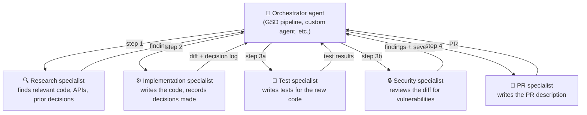
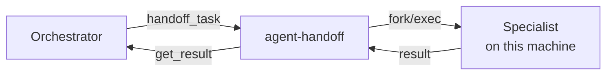
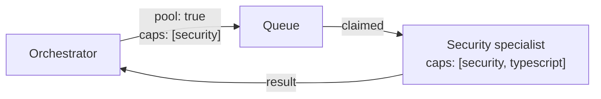

# agent-handoff

**MCP server for multi-step agentic pipelines.** An orchestrator agent breaks work into steps and hands each step to a specialist — a research agent, an implementation agent, a security reviewer, a test writer. Each specialist runs in its own isolated context. Results flow back typed and clean.

Works with any MCP-compatible AI: Claude Code, Cursor, Windsurf, Zed, Claude Desktop.

---

## The problem it solves

Without agent-handoff, an orchestrator doing multi-step work holds everything itself: it researches, implements, tests, and reviews — and every intermediate result piles up in its context window. By step 4, the orchestrator is slow, forgetful, and making decisions based on a context stuffed with things it no longer needs.

agent-handoff isolates each step in a specialist. The orchestrator stays lean. Each specialist gets exactly the context it needs for its job, nothing more.

---

## How it works



Each specialist is a separate agent with its own context — it receives only what it needs for its step, does the work, and returns a structured result. The orchestrator never holds the work itself; it only holds the results it needs to decide what comes next.

---

## Install

> **Requires Bun.** If you don't have it: `curl -fsSL https://bun.sh/install | bash`

```bash
npm install -g @daax-dev/agent-handoff
```

---

## Connect to your orchestrator

### Claude Code

```bash
claude mcp add agent-handoff -- agent-handoff-mcp
```

Restart Claude Code. The orchestrator can now call `handoff_task` to delegate steps to specialists.

<details>
<summary>Other editors — Cursor, Windsurf, Zed, Claude Desktop</summary>

Add to your MCP config:

```json
{
  "mcpServers": {
    "agent-handoff": {
      "command": "agent-handoff-mcp"
    }
  }
}
```

Config file locations: [docs/installation-guide.md](docs/installation-guide.md)

</details>

---

## Orchestrator usage

> **These are MCP tools your orchestrator calls in its pipeline logic** — not things you type manually. Your orchestrator invokes them as it works through steps.

### Check which specialists are available

```
list_agents
```
```
✓  claude    available
✗  codex     not found
✓  gemini    available
```

### Hand off a step to a specialist

```
handoff_task({
  agent: "claude",
  prompt: "You are the security specialist. Review this diff for injection vulnerabilities, auth gaps, and data exposure. See context for what was implemented and why.",
  workingDirectory: "/path/to/project",
  contextPayload: <prior step output>
})
```

Returns a job ID immediately. The orchestrator can start other parallel steps or wait.

### Collect the result

```
get_result({ jobId: "hnd_a1b2c3" })
```

```
✓ done   Security review complete
findings: 1 high (SQL injection risk, line 47), 2 low
recommendation: fix before merge
```

The orchestrator reads the structured result and decides the next step — fix the issue, escalate, or continue.

### Run parallel steps

Specialists that don't depend on each other can run at the same time:

```
// Orchestrator dispatches both simultaneously
handoff_task({ agent: "claude", prompt: "Write tests for the new auth module...", ... })
handoff_task({ agent: "gemini", prompt: "Review the auth diff for security issues...", ... })

// Then waits for both before proceeding
get_result({ jobId: "hnd_tests_001" })
get_result({ jobId: "hnd_security_001" })
```

---

## How specialists connect

### Local (default)

The specialist runs on the same machine. agent-handoff spawns it as a child process, captures its output, exit code, and git diff.



To watch a specialist run live, pass `spawnMode: "tmux"` — this opens a `daax-claude` pane.

---

### Remote (A2A)

Register any [A2A-compliant](https://google.github.io/A2A/) specialist by URL. Good for specialists running on dedicated machines, with specific tooling, or managed by another team.


```
register_agent({ url: "https://security-agent.internal", authToken: "tok_abc" })
```

Cross-machine setup: [docs/cross-machine-and-auth.md](docs/cross-machine-and-auth.md)

---

### Pool (capability-matched dispatch)

Post a step to a queue with required capabilities. Registered specialists with matching capabilities pull and run it. Good for pipelines that fan out to many workers, or when specialist availability is dynamic.



---

## Passing context between steps

Each specialist gets a `contextPayload` with what was done before, what decisions were made, and what files were changed — so it isn't starting from scratch.

```typescript
import { createHandoffContext, serializeContext } from "@daax-dev/agent-handoff/handoff-context";

const context = serializeContext(createHandoffContext({
  sourceJobId: implementationJobId,
  completed_tasks: [{ id: "t-1", title: "Implemented parameterised queries" }],
  decisions: [{
    description: "Switched from string interpolation to pg parameterised queries",
    rationale: "SQL injection risk flagged in prior security pass"
  }],
  modified_files: [{ path: "src/db/queries.ts", changeType: "modified" }],
  next_steps: [{ order: 1, description: "Write integration tests covering the parameterised path" }]
}));

handoff_task({
  agent: "claude",
  prompt: "You are the test specialist. Write integration tests. See context for what changed and why.",
  contextPayload: context
})
```

Payloads are compressed. Limits: 50 KB compressed, 500 KB uncompressed.

---

## Definition of Done

Require a specialist to commit to success criteria before it starts. If it can't meet a required criterion, the handoff fails immediately — before any work is done.

```
handoff_task({
  agent: "claude",
  prompt: "Implement OAuth2 support...",
  dodCriteria: [
    { description: "All existing tests still pass", required: true  },
    { description: "TypeScript compiles cleanly",   required: true  },
    { description: "API docs updated",              required: false }
  ]
})
```

`CAPABILITY_MISMATCH` — specialist declared it can't meet a required criterion.  
`ACK_TIMEOUT` — retried automatically with exponential backoff (5 attempts).

---

## Managing tasks from your terminal

> **For humans.** Use the CLI to inspect, approve, and manage the work your pipeline produced. These are not orchestrator tools — they're for you to see what's happening and act on it.

Start the API server:

```bash
agent-handoff-server
# listening on http://localhost:4000
```

```bash
export AGENT_HANDOFF_URL=http://localhost:4000

agent-handoff new "add rate limiting"    # create a task
agent-handoff list                        # see all active tasks
agent-handoff status chg_000001          # detail on one
agent-handoff review chg_000001          # CI status + review comments
agent-handoff approve chg_000001         # approve
agent-handoff merge chg_000001           # merge the branch
agent-handoff export chg_000001          # push + open GitHub PR
agent-handoff import-issue <url>         # pull a GitHub issue in as a task
```

---

## Configuration

### MCP server

| Variable | Default | What it does |
|----------|---------|-------------|
| `HANDOFF_LOG_DIR` | `.logs/handoffs` | Where to write event logs |
| `HANDOFF_LOG_PROMPTS` | `false` | Set `true` to log prompt text (redacted by default) |
| `HAWKEYE_URL` | _(unset)_ | Endpoint to notify when a DoD handshake times out |
| `RECEIVER_CAPABILITIES` | _(unset)_ | Capabilities this server evaluates locally for DoD |

### REST API server

| Variable | Default | What it does |
|----------|---------|-------------|
| `PORT` | `4000` | Port to listen on |
| `API_TOKEN` | _(unset)_ | Require `Authorization: Bearer <token>` on all requests |

### CLI

| Variable | Default | What it does |
|----------|---------|-------------|
| `AGENT_HANDOFF_URL` | `http://localhost:4000` | REST API URL |
| `AGENT_HANDOFF_TOKEN` | _(unset)_ | Bearer token |

---

## Development

```bash
bun run test       # run all tests
bun run typecheck  # TypeScript check
```

To add a specialist adapter: create `src/cli/<name>.ts` extending `BaseAdapter`, add to `AgentName` in `src/types.ts`, register in `src/cli/registry.ts`, add tests in `tests/cli-adapters.test.ts`.

Full MCP tool reference and response shapes: [docs/rest-api.md](docs/rest-api.md)  
FAQ and non-MCP usage: [docs/faq.md](docs/faq.md)
